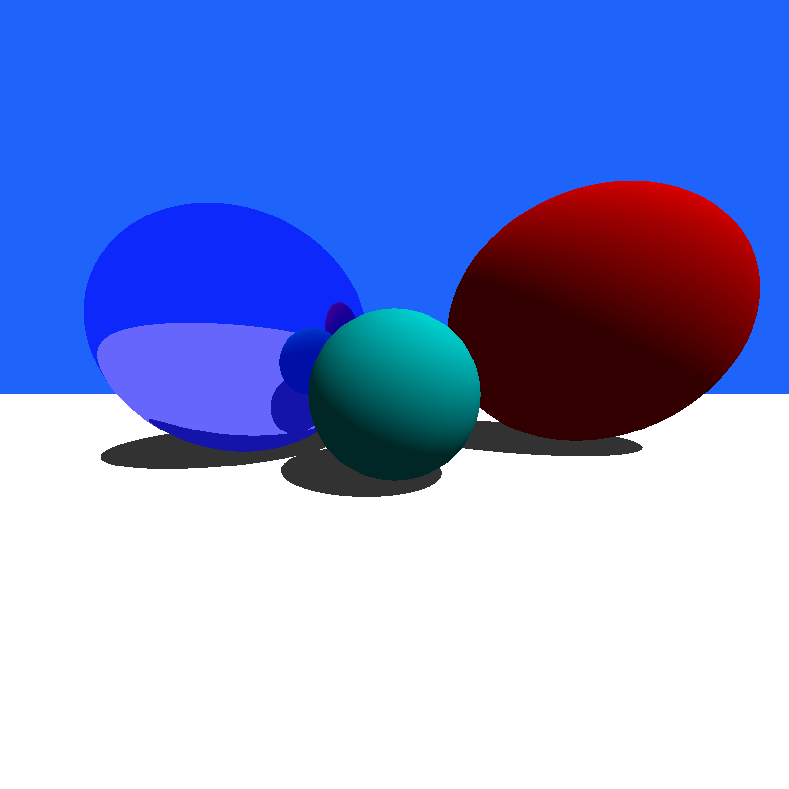

# haskell-raytracer

## Motivation
I started work on this simple raytracer written as a Haskell package as an
introduction to some concepts in computer graphics. It was also a good way to
see what makes performance sensitive code fast or slow in Haskell.

## What it does
After cloning this repository, run `stack build` and then `stack exec example`
and an image will be outputted to `example.png`. The actual raytracing module
is in `src/Raytracer.hs` and the example scene is in `example/Main.hs`.

It currently supports spheres and planes, solid colored diffuse and reflective
materials, ambient lighting, and different fields-of-view and light directions.
It has decent performance, but I'm sure many optimizations could be made.

When running the example, you should get the image below (rendered in 4k):

